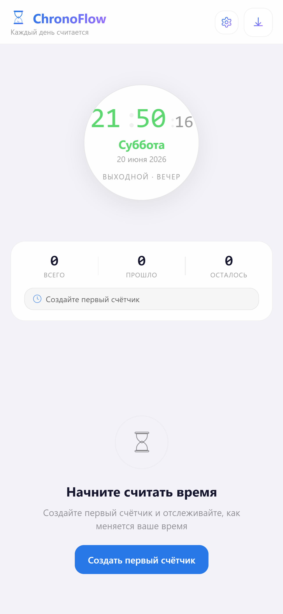
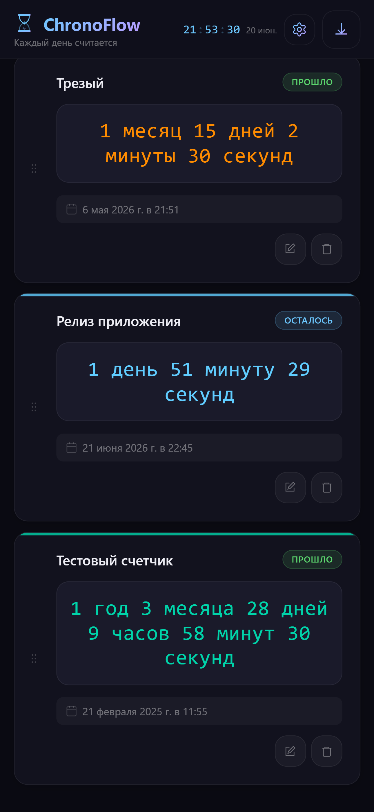
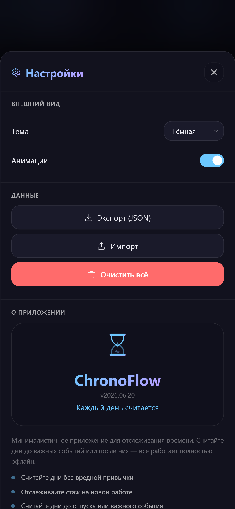

# ChronoFlow

Минималистичный таймер для отслеживания времени. Каждый день считается.

Считайте дни до важных событий или после них. Всё работает полностью офлайн, без регистрации и серверов.

## Функции

- Аналоговые часы с Canvas — сегменты по дням недели, прогресс-кольцо, glow-эффект
- Ultra-Light типографика с пульсацией двоеточия (1 Гц)
- Два типа счётчиков: «сколько прошло» и «сколько осталось»
- Точность до секунды — годы, месяцы, дни, часы, минуты
- Свой цвет для каждого счётчика + HSL-пипетка
- Swipe-to-action на карточках (iOS Mail стиль)
- Pull-to-refresh жест
- Swipe-down для закрытия модалок
- Drag-and-drop reorder счётчиков
- Тёмная и светлая темы с переключением (системная / ручная)
- Undo при удалении счётчика
- Экспорт / импорт данных в JSON
- Полная офлайн-работа — PWA на вашем устройстве
- Адаптивный UI: смартфон → планшет → десктоп
- Safe Area для Dynamic Island и челки iPhone
- Анимации скролла: часы сжимаются → заголовок «Счётчики» появляется

## Скриншоты

<details>
<summary>Часы и счётчики</summary>

</details>

<details>
<summary>Тёмная тема</summary>

</details>

<details>
<summary>Светлая тема</summary>

</details>

## Технологии

- **HTML5** — семантическая вёрстка, ARIA
- **CSS** — CSS Variables, clamp(), media queries, backdrop-filter
- **Canvas 2D** — часы с сегментами, кольцом, свечением
- **Service Worker** — offline-first кэширование
- **SVG** — градиентная иконка приложения
- **Touch Gestures** — swipe, pull-to-refresh, haptic feedback

## Установка

Откройте `./index.html` в браузере или разверните через любой HTTP-сервер:

```bash
npx serve .
```

## Структура

```
├── index.html        ← разметка + SVG-градиенты
├── styles.css        ← стили, темы, медиа-запросы
├── app.js            ← логика, Canvas, хранение, жесты
├── sw.js             ← Service Worker
├── version.js        ← единый источник версии
├── manifest.json     ← PWA-манифест со скриншотами
├── icon.svg          ← иконка приложения (SVG)
├── icon-180.png      ← иконка для iOS (180x180)
├── icon-192.png      ← иконка для Android (192x192)
├── icon-512.png      ← иконка для splash (512x512)
├── screen01.png      ← скриншот
├── screen02.png      ← скриншот
├── screen03.png      ← скриншот
├── privacy.html      ← политика конфиденциальности
└── terms.html        ← условия использования
```

## Лицензия

MIT
